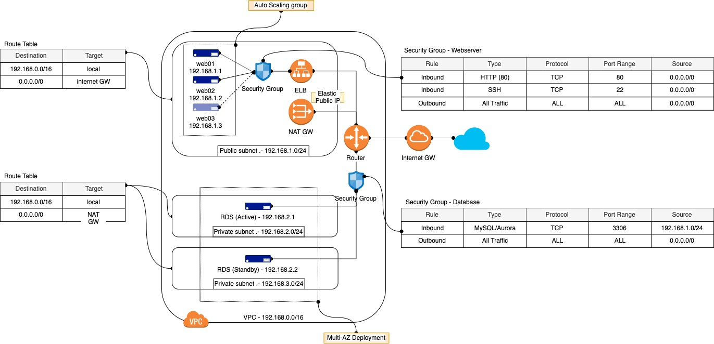

# Symbiosis Web Application

## Architecture Explained

Based on the high level requirements, basically the client would like to have a highly available and elastic web tier which connects to the highly available managed SQL database. There are 2 ways to implement this solution namely **Traditional** and **Cloud-native**. Let's deep dive into the 2 implementations.

### _Traditional Architecture_

#### 1) Web
1) In the traditional architecture, the webservers are deploye as EC2 instances within an `Auto Scaling Group (ASG)` to provide elasticity to scale in and out based on the actual demand. The scaling policy can be based on:
* Load Balancer requests
* CPU utilization
* Average In/out traffic

2) To ensure seamless access to the web application, an `Elastic Load Balancer (ELB)` must be deployed to handle the elasticity of the webservers and ensure the traffic wont get routed to "unhealthy" instances using health checks to the html index directory. Based on the requirement, the client would like to implement a load balancer operates in L4 and L7, hence a `Classic Load Balancer` is needed.    

#### 2) Database
1) AWS offers managed database service called RDS which supports different SQL database engine such as MySQL, PostgreSQL, Oracle etc. Based on the client's requirement to have a highly available database, RDS supports `Multi-AZ Deployment` to run a standby database node on a different AZ which the active database node is running. The traffic will be directed seamlessly to the standby node in another AZ if the active node is down for some reasons.

#### 3) Network
1) Now let's look at the network architecture for the Symbiosis Webapp.
2) The VPC of private IP address 192.168.0.0/16 is assigned to Symbiosis and it's futher broken into smaller subnets as seen in the diagram.
3) In general there are 2 types of subnets will be created:
* Public subnet: able to route to the Internet gateway and a public IP address will be assigned to the each EC2 instance created using this subnet for inbound access.
* Private subnet: only for internal access to this subnet and the outbound traffic will go through NAT gateway via its Elastic IP address (EIP).
4) For the Multi-AZ Deployment mode of RDS, each AZ requires one private subnet hence 2 private subnets must be created for RDS.
5) Although the web traffic will be routed through ELB, the websevers still require public subnet for inbound access for system administration purposes.

#### 4) Network Security
1) To prevent unauthorised access to the nodes from both internally and externally, there will be 2 Security Groups to protect the web tier and database tier.
2) The web tier should only allow HTTP and SSH inbound access and the database should only allow port 3306 (assuming MySQL is used) access from the subnet assigned to the webservers.  

### _Cloud-native Architecture_

In the traditional architecture, each webserver is deployed as individual EC2 instance and this requires tremendous effort from the system adminitrators to take care of the system life cyle, patch management, dependancies etc.. as the application starts to grow indefitely. This will also introduce resource overheads because each EC2 instance will need compute and storage resources to run the OS along with the application itself.

In 2013, Docker was born to strip down the monolithic application into microservices and minimise the dependancies between developers and system administrators. In 2014, Kubernetes was born to manage and orchastrate the microservices at scale and it still remains as the most adopted container orchastrator till date. AWS provides `Elastic Kubernetes Service (EKS)` to help companies to deploy stable Kubernetes clusters on AWS. Although AWS also provides their propiertary `Elastic Container Service (ECS)` without additional costs to host the control plane, most companies would want to avoid vendor lock-in so adopting open source technology will certainly helps to achieve that strategy.

#### Containerised Web service

1) Since the client still prefer a managed SQL database, the design for database tier will remain the same but the Security Group policy need to be changed to allow the Web application pod to access the database across 3 AZs.
2) EKS will be deployed with multi-AZ master nodes and worker nodes.
3) Instead of using ELB to route the traffic to the webserver, once the Web deployment is exposed as a Service, the inbuilt Nginx ingress controller will assign an external IP and it will route the traffic to the Web pods.
4) The web application is a stateless  
